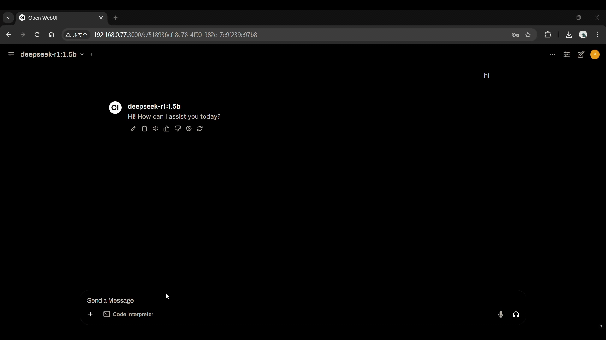

Enable real-time, offline Retrieval-Augmented Generation (RAG) on AMD Rocm™ with DeepSeek and LangChain. This container integrates a FastAPI-powered LangChain middleware with Ollama and the DeepSeek R1 1.5B model, providing a lightweight, GPU-accelerated runtime for building custom RAG pipelines. Designed for edge AI workflows, it offers an efficient development environment to implement document-grounded Q&A, contextual assistants, and autonomous agents—all running locally on Rocm devices.

# Deepseek-R1 1.5B Langchain AI Agent (RAG) on AMD Rocm™

### About Advantech Container Catalog
The Advantech Container Catalog offers plug-and-play, GPU-accelerated container images for Edge AI development on AMD Rocm™. These containers abstract hardware complexity, enabling developers to build and deploy AI solutions without worrying about drivers, runtime.

### Key benefits of the Container Catalog include:
| Feature / Benefit                              | Description                                                                |
|----------------------------------------------------|--------------------------------------------------------------------------------|
| Accelerated Edge AI Development                    | Ready-to-use containerized solutions for fast prototyping and deployment       |
| Hardware Compatibility Solved                      | Eliminates embedded hardware and AI software package incompatibility           |
| GPU/NPU Access Ready                               | Supports passthrough for efficient hardware acceleration                       |
| Model Conversion & Optimization                    | Built-in AI model quantization and format conversion support                   |
| Optimized for CV & LLM Applications                | Pre-optimized containers for computer vision and large language models         |
| Open Ecosystem                                     | 3rd-party developers can integrate new apps to expand the platform             |

## Container Overview

The Deepseek-R1 1.5B Langchain AI Agent (RAG) on AMD Rocm™ delivers a plug-and-play AI runtime for AMD Rocm™ devices, purpose-built for Retrieval-Augmented Generation workflows. It integrates the DeepSeek R1 1.5B model (served via Ollama) with LangChain’s FastAPI middleware and OpenWebUI for a complete, on-device RAG solution. This container provides a prebuilt sample for RAG applications.

This container enables:

- Offline, on-device LLM inference using DeepSeek R1 1.5B via Ollama (no internet required post-setup)
- LangChain middleware with FastAPI for orchestrating modular pipelines
- Built-in FAISS vector database for efficient semantic search and RAG use case
- Agent support to enable autonomous, multi-step task execution and decision-making
- Prompt memory and context handling for smarter conversations
- Streaming chat UI via OpenWebUI
- OpenAI-compatible API endpoints for seamless integration
- Customizable model parameters via modelfile & environment variables
- Provides prebuilt code sample for showcasing RAG use case

## Container Demo

## Use Cases

- Legal Document Assistant: Query contracts, case law, or internal legal memos without exposing sensitive legal data to the cloud.
- Internal SOP Assistant: Build a smart assistant for internal Standard Operating Procedures (SOPs) to help employees follow the correct steps across various department operations.
- Medical Protocol Access (Offline): Offer doctors and staff instant, voice-accessible retrieval from medical guidelines, drug data, and SOPs, even in low-connectivity zones
- Compliance and Audit Q&A: Run offline LLMs trained on local policy or compliance data to assist with audits or generate summaries of regulatory alignment—ensuring data never leaves the premises.
- Safety Manual Conversational Agents: Deploy LLMs to provide instant answers from on-site safety manuals or procedures, reducing downtime and improving adherence to protocols.
- Conversational Retrieval (RAG): Extend the container capabilities for developing use cases around RAGs. The container already provides a working sample.
- Tool-Enabled Agents: Create intelligent agents that use calculators, APIs, or search tools as part of their reasoning process—LangChain handles the logic and LLM interface.

## Key Features

- LangChain Middleware: Agent logic with memory and modular chains
- Prebuilt RAG Example: Provides a prebuilt RAG application that retrieves info from a PDF, which could be referenced/extended for further use case development
- Ollama Integration: Lightweight inference engine for quantized models
- Complete AI Framework Stack: PyTorch, TensorFlow, ONNX Runtime
- Industrial Vision Support: Accelerated OpenCV and GStreamer pipelines
- Edge AI Capabilities: Support for computer vision, LLMs, and time-series analysis
- RAG/Agent Use Cases Supported: Accelerated environment to develop use cases that involve agents, RAGs, etc.

## Host Device Prerequisites
| Item | Specification                                                                                                                                                             |
|-----------|---------------------------------------------------------------------------------------------------------------------------------------------------------------------------|
| Compatible Hardware | Advantech devices accelerated by AMD Rocm™ |
| AMD Rocm™ Version | 5.7.0-1                                                                                                                                                                    |
|Host OS          | Ubuntu 24.04                                                                                                                                                              |
| Required Software Packages | Refer to Below                                                                                                                                                            |
|Software Installation| [AMD Rocm™ Software Package Installation](https://rocm.docs.amd.com/projects/radeon-ryzen/en/latest/docs/install/installrad/native_linux/install-radeon.html)                                                    |                                                                                                        |

## Container Environment Overview

### Software Components on Container Image

| Component        | Version        | Description                                              |
|------------------|----------------|----------------------------------------------------------|
| Ollama           | 0.5.7          | LLM inference engine                                     |
| LangChain        | 0.2.17         | Orchestration layer for memory, RAG, and agent workflows |
| FastAPI          | 0.115.12       | API service exposing LangChain interface                 |
| OpenWebUI        | 0.6.5          | Web interface for chat interactions                      |
| FAISS            | 1.8.0.post1    | Vector store for RAG pipelines                           |
| RAG Code Sample | NA | Sample code that shows RAG capability development |
| Sentence-T5-Base | NA             | Pulls sentence-t5-base embedding model from HF           |

### Language Models Recommendation

| Model Family | Parameters | Quantization | Size | Performance  |
|--------------|------------|--------------|------|--------------|
| DeepSeek R1 | 1.5 B | Q4_K_M | 1.1 GB | ~15-17 tokens/sec |
| DeepSeek R1 | 7 B | Q4_K_M | 4.7 GB | ~5-7 tokens/sec |
| DeepSeek Coder | 1.3 B | Q4_0 | 776 MB | ~20-25 tokens/sec |
| Llama 3.2 | 1 B | Q8_0 | 1.3 GB | ~17-20 tokens/sec |
| Llama 3.2 Instruct | 1 B | Q4_0 | ~0.8 GB | ~17-20 tokens/sec |
| Llama 3.2 | 3 B | Q4_K_M | 2 GB | ~10-12 tokens/sec |
| Llama 2 | 7 B | Q4_0 | 3.8 GB | ~5-7 tokens/sec |
| Tinyllama | 1.1 B | Q4_0 | 637 MB | ~22-27 tokens/sec |
| Qwen 2.5 | 0.5 B | Q4_K_M | 398 MB | ~25-30 tokens/sec |
| Qwen 2.5 | 1.5 B | Q4_K_M | 986 MB | ~15-17 tokens/sec |
| Qwen 2.5 Coder | 0.5 B | Q8_0 | 531 MB | ~25-30 tokens/sec |
| Qwen 2.5 Coder | 1.5 B | Q4_K_M | 986 MB | ~15-17 tokens/sec |
| Qwen | 0.5 B | Q4_0 | 395 MB | ~25-30 tokens/sec |
| Qwen | 1.8 B | Q4_0 | 1.1 GB | ~15-20 tokens/sec |
| Gemma 2 | 2 B | Q4_0 | 1.6 GB | ~10-12 tokens/sec |
| Mistral | 7 B | Q4_0 | 4.1 GB | ~5-7 tokens/sec |                                     |

*Tuning Tips for Efficient RAG and Agent Workflows:**
- Use asynchronous chains and streaming response handlers to reduce latency in FastAPI endpoints.
- For RAG pipelines, use efficient vector stores (e.g., FAISS with cosine or inner product) and pre-filter data when possible.
- Avoid long chain dependencies; break workflows into smaller composable components.
- Cache prompt templates and tool results when applicable to reduce unnecessary recomputation  
- For agent-based flows, limit tool calls per loop to avoid runaway execution or high memory usage.
- Log intermediate steps (using LangChain’s callbacks) for better debugging and observability
- Use models with ≥3B parameters (e.g., Llama 3.2 3B or larger) for agent development to ensure better reasoning depth and tool usage reliability.
- Use FAISS or Chroma with pre-computed embeddings for faster retrieval
- Apply score thresholding in retriever config to filter irrelevant documents
- Keep persistent vector DB (e.g., FAISS saved index) to avoid re-indexing on container restart
- Use appropriate (size/precision) embedding models as per the suitability of the use case.

## Supported AI Model Formats

| Format                  | Support Level | Compatible Versions            | Notes                                         |
|-------------------------|---------------|--------------------------------|-----------------------------------------------|
| ONNX                    | Full          | 1.10.+ - 1.16.+                | Recommended for cross-framework compatibility |
| PyTorch (.pt, .pth,JIT) | Full          | 2.1+ - 2.5+                    | Native support via TorchScript                |
| TensorFlow SavedModel   | Full          | 2.10.0 - 2.14.0                | Recommended TF deployment format              |
| TFLite                  | Partial       | Up to 2.12+                    | May have limited hardware acceleration        |
| GGUF                    | Full          | llama.cpp b3000+ Ollama latest | Format used by Ollama backend                 |

## Hardware Acceleration Support

AMD ROCm Hardware Acceleration Support Matrix (2026 Q1)
| Accelerator Series | Specific Models (Examples) | Architecture | Support Level | Compatible Libraries & Frameworks | Notes |
| :--- | :--- | :--- | :---  |:--- | :--- |
| Instinct MI350 | MI355X, MI350X | CDNA 4 | Native / Tier 1 | PyTorch 2.6+, TensorFlow, JAX, ONNX Runtime, DeepSpeed, vLLM, FlashAttention-3 | Flagship. Optimized for FP8/FP4 AI training. Full support on Linux. Windows support via HIP is in Preview. |
| Instinct MI300 | MI300X, MI300A, MI308X | CDNA 3 | Native / Tier 1 | PyTorch 2.5+, TensorFlow, JAX, Triton, RCCL, MIOpen | Industry standard for LLMs. Mature ecosystem. Excellent multi-GPU scaling. |
| Instinct MI200 | MI250X, MI250, MI210 | CDNA 2 | Native / Tier 1 | PyTorch, TensorFlow, OpenMPI, MAGMA | Legacy HPC focus. Still widely used in supercomputers (e.g., Frontier). No FP8 hardware support. |
| Radeon RX 9000 | RX 9070 XT, 9070, 9060 XT | RDNA 4 | Native / Tier 2 | PyTorch 2.6+, vLLM (quantized), Stable Diffusion WebUI, llama.cpp | New Consumer Flagship. First gen with full ROCm stack out-of-the-box. Ideal for local inference & fine-tuning. gfx1200 target. |
| Radeon RX 8000 | RX 8900 XTX, 8900 XT | RDNA 3.5 | Stable / Tier 2 | PyTorch 2.5+, TensorFlow, DirectML (Win) | High-end consumer cards. Requires latest ROCm 6.3+ for full stability. Good for dev/test. |
| Radeon PRO W | W7900, W7800, AI PRO R9700 | RDNA 3 / 3.5 | Certified / Tier 1 | PyTorch, TensorFlow, Blender, DaVinci Resolve, SPECviewperf | Workstation certified drivers. Priority support for ISV applications. |
| Ryzen AI (APU) | Strix Halo (Ryzen AI 300), Phoenix | RDNA 3.5 + NPU | Experimental / Tier 3 | ONNX Runtime, OpenVINO, limited PyTorch | Uses iGPU + NPU. Memory bandwidth limited by system RAM. Best for edge inference demos. |
| Radeon RX 7000 | RX 7900 XTX, 7900 XT | RDNA 3 | Community / Tier 2 | PyTorch (via forks or latest official), llama.cpp | Support stabilized in ROCm 6.0+. May require manual env vars (HSA_OVERRIDE_GFX_VERSION). |
| Older Gen | RX 6000, Vega, Polaris | RDNA 2 / GCN | Deprecated / Limited | Older PyTorch versions, HipBLAS (legacy) | Not recommended for new AI workloads. No support for modern transformers libraries. |
