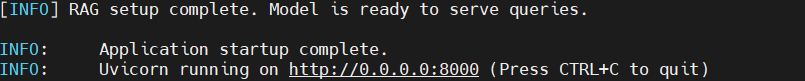
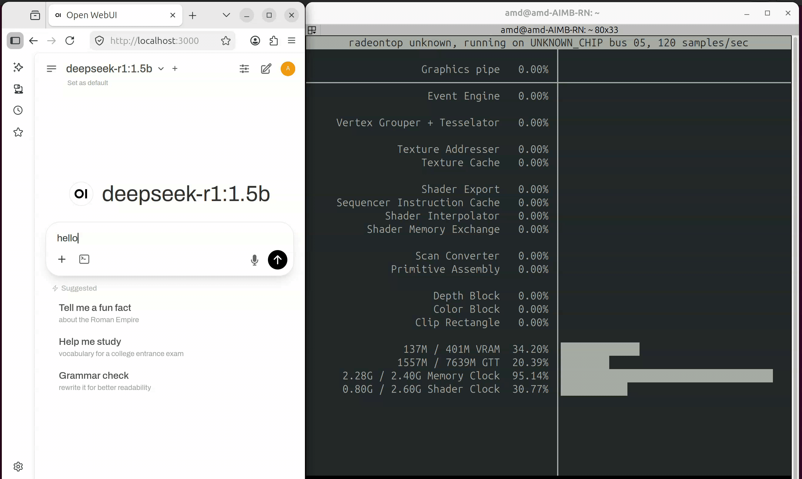
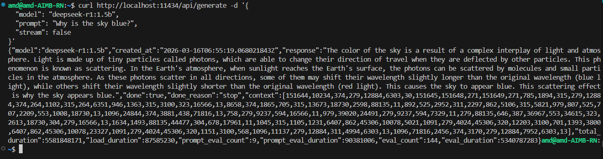

# Edge LLM Langchain AI Agent (RAG) on AMD Rocm 

## Overview
Deepseek-R1 1.5B Langchain AI Agent (RAG) on AMD Rocm Image delivers a modular, high-performance AI chat solution tailored for Rocm™ edge devices that extracts relevant information from a PDF document. It combines Ollama with the DeepSeek R1 1.5B model for LLM inference, a FastAPI-based Langchain middleware for orchestration and tool integration, and OpenWebUI for an intuitive user interface. The container supports Retrieval-Augmented Generation (RAG), tool-augmented reasoning, conversational memory, and custom LLM workflows, making it ideal for building intelligent, context-aware agents. It is fully optimized for hardware acceleration on Rocm platforms. This container particularly shows how RAG use case could be built using DeepSeek & Langchain.

## Host System Requirements
Need ROCm support. Use the rocminfo command to check ROCm information.

```bash
sudo rocminfo
```

```
ROCk module is loaded
=====================
HSA System Attributes
=====================
Runtime Version:         1.1
System Timestamp Freq.:  1000.000000MHz
Sig. Max Wait Duration:  18446744073709551615 (0xFFFFFFFFFFFFFFFF) (timestamp count)
Machine Model:           LARG
System Endianness:       LITTLE
Mwaitx:                  DISABLED
DMAbuf Support:          YES
==========

HSA Agents
==========
*******
Agent 1
*******
  Name:                    AMD Ryzen 7 PRO 8845HS w/ Radeon 780M Graphics
  Uuid:                    CPU-XX
  Marketing Name:          AMD Ryzen 7 PRO 8845HS w/ Radeon 780M Graphics
  Vendor Name:             CPU
  Feature:                 None specified
  Profile:                 FULL_PROFILE
  Float Round Mode:        NEAR
  Max Queue Number:        0(0x0)
  Queue Min Size:          0(0x0)
  Queue Max Size:          0(0x0)
  Queue Type:              MULTI
  Node:                    0
  Device Type:             CPU
  Cache Info:
    L1:                      32768(0x8000) KB
  Chip ID:                 0(0x0)
  ASIC Revision:           0(0x0)
  Cacheline Size:          64(0x40)
  Max Clock Freq. (MHz):   0
  BDFID:                   0
  Internal Node ID:        0
  Compute Unit:            16
  SIMDs per CU:            0
  Shader Engines:          0
  Shader Arrs. per Eng.:   0
  WatchPts on Addr. Ranges:1
  Features:                None
  Pool Info:
    Pool 1
      Segment:                 GLOBAL; FLAGS: FINE GRAINED
      Size:                    15593232(0xedef10) KB
      Allocatable:             TRUE
      Alloc Granule:           4KB
      Alloc Alignment:         4KB
      Accessible by all:       TRUE
    Pool 2
      Segment:                 GLOBAL; FLAGS: KERNARG, FINE GRAINED
      Size:                    15593232(0xedef10) KB
      Allocatable:             TRUE
      Alloc Granule:           4KB
      Alloc Alignment:         4KB
      Accessible by all:       TRUE
    Pool 3
      Segment:                 GLOBAL; FLAGS: COARSE GRAINED
      Size:                    15593232(0xedef10) KB
      Allocatable:             TRUE
      Alloc Granule:           4KB
      Alloc Alignment:         4KB
      Accessible by all:       TRUE
  ISA Info:
*******
Agent 2
*******
  Name:                    gfx1103
  Uuid:                    GPU-XX
  Marketing Name:          AMD Radeon 780M Graphics
  Vendor Name:             AMD
  Feature:                 KERNEL_DISPATCH
  Profile:                 BASE_PROFILE
  Float Round Mode:        NEAR
  Max Queue Number:        128(0x80)
  Queue Min Size:          64(0x40)
  Queue Max Size:          131072(0x20000)
  Queue Type:              MULTI
  Node:                    1
  Device Type:             GPU
  Cache Info:
    L1:                      32(0x20) KB
    L2:                      2048(0x800) KB
  Chip ID:                 6400(0x1900)
  ASIC Revision:           12(0xc)
  Cacheline Size:          64(0x40)
  Max Clock Freq. (MHz):   2700
  BDFID:                   1536
  Internal Node ID:        1
  Compute Unit:            12
  SIMDs per CU:            2
  Shader Engines:          1
  Shader Arrs. per Eng.:   2
  WatchPts on Addr. Ranges:4
  Features:                KERNEL_DISPATCH
  Fast F16 Operation:      TRUE
  Wavefront Size:          32(0x20)
  Workgroup Max Size:      1024(0x400)
  Workgroup Max Size per Dimension:
    x                        1024(0x400)
    y                        1024(0x400)
    z                        1024(0x400)
  Max Waves Per CU:        32(0x20)
  Max Work-item Per CU:    1024(0x400)
  Grid Max Size:           4294967295(0xffffffff)
  Grid Max Size per Dimension:
    x                        4294967295(0xffffffff)
    y                        4294967295(0xffffffff)
    z                        4294967295(0xffffffff)
  Max fbarriers/Workgrp:   32
  Packet Processor uCode:: 35
  SDMA engine uCode::      16
  IOMMU Support::          None
  Pool Info:
    Pool 1
      Segment:                 GLOBAL; FLAGS: COARSE GRAINED
      Size:                    7796616(0x76f788) KB
      Allocatable:             TRUE
      Alloc Granule:           4KB
      Alloc Alignment:         4KB
      Accessible by all:       FALSE
    Pool 2
      Segment:                 GLOBAL; FLAGS:
      Size:                    7796616(0x76f788) KB
      Allocatable:             TRUE
      Alloc Granule:           4KB
      Alloc Alignment:         4KB
      Accessible by all:       FALSE
    Pool 3
      Segment:                 GROUP
      Size:                    64(0x40) KB
      Allocatable:             FALSE
      Alloc Granule:           0KB
      Alloc Alignment:         0KB
      Accessible by all:       FALSE
  ISA Info:
    ISA 1
      Name:                    amdgcn-amd-amdhsa--gfx1103
      Machine Models:          HSA_MACHINE_MODEL_LARGE
      Profiles:                HSA_PROFILE_BASE
      Default Rounding Mode:   NEAR
      Default Rounding Mode:   NEAR
      Fast f16:                TRUE
      Workgroup Max Size:      1024(0x400)
      Workgroup Max Size per Dimension:
        x                        1024(0x400)
        y                        1024(0x400)
        z                        1024(0x400)
      Grid Max Size:           4294967295(0xffffffff)
      Grid Max Size per Dimension:
        x                        4294967295(0xffffffff)
        y                        4294967295(0xffffffff)
        z                        4294967295(0xffffffff)
      FBarrier Max Size:       32
*** Done ***
```

## Key Features

| Feature                          | Description                                                                                                                              |
|----------------------------------|------------------------------------------------------------------------------------------------------------------------------------------|
| Prebuilt RAG Example         | Provides a prebuilt RAG application that retrieves info from a PDF; could be referenced/extended for further use case development easily |
| Integrated OpenWebUI         | Clean, user-friendly frontend for LLM chat interface                                                                                     |
| DeepSeek R1 1.5B Inference   | Efficient on-device LLM via Ollama; minimal memory, high performance                                                                     |
| Model Customization          | Create or fine-tune models using `ollama create`                                                                                         |
| REST API Access              | Simple local HTTP API for model interaction                                                                                              |
| Flexible Parameters          | Adjust inference with `temperature`, `top_k`, `repeat_penalty`, etc.                                                                     |
| Modelfile Customization      | Configure model behavior with Docker-like `Modelfile` syntax                                                                             |
| Prompt Templates             | Supports formats like `chatml`, `llama`, and more                                                                                        |
| LangChain Integration        | Multi-turn memory with `ConversationChain` support                                                                                       |
| FastAPI Middleware           | Lightweight interface between OpenWebUI and LangChain                                                                                    |
| Offline Capability           | Fully offline after container image setup; no internet required                                                                          |
| RAG/Agent Use Case Supported | Accelerated environment to develop use cases that involve Agents, RAGs, etc.                                                               |


## Architecture


## Repository Structure
```
Deepseek-R1-1.5B-Langchain-AI-Agent-RAG-on-AMD-Rocm/
├── .env                                      # Environment configuration
├── build.sh                                  # Build helper script
├── wise-bench.sh                             # Wise Bench script
├── docker-compose.yml                        # Docker Compose setup
├── README.md                                 # Overview
├── quantization-readme.md                    # Model quantization steps
├── other-AI-capabilities-readme.md           # Other AI capabilities supported by container image
├── llm-models-performance-notes-readme.md    # Performance notes of LLM Models
├── efficient-prompting-for-compact-models.md # Craft better prompts for small and quantized language models
├── customization-readme.md                   # Customization, optimization & configuration guide
├── .gitignore                                # Git ignore specific files
├── data/                                     # Supporting media assets
│   ├── architecture/
│   │   └── langchain-rag.png                 # RAG architecture diagram (LangChain + vector store)
│   ├── gifs/
│   │   └── rag-demo-1.gif                    # Demo GIF of querying the RAG service end-to-end
│   └── images/
│       ├── fast-api-curl.png                 # Example curl call to the FastAPI endpoint
│       ├── gguf-convert.png                  # Converting models to GGUF (process snapshot)
│       ├── hugging-face-token.png            # Where to set/use the Hugging Face access token
│       ├── kvcache-after.png                 # Inference metrics with KV cache enabled (after)
│       ├── kvcache-before.png                # Inference metrics without KV cache (before)
│       ├── langchain-wise-bench.png          # Wise-Bench results/summary for LangChain pipeline
│       ├── ollama-curl.png                   # curl example for interacting with Ollama server
│       ├── ollama-status.png                 # Ollama status/ps output screenshot
│       ├── quantization.png                  # Overview of quantization levels/options
│       ├── quantize-help.png                 # CLI help for quantization utility
│       ├── rag-start-log.png                 # Service startup logs for RAG (verification snapshot)
│       └── select-model.png                  # Model selection screen/CLI example
└── langchain-rag-service/                    # Core LangChain RAG API service
    ├── pdfs/                                 # Folder to store pdf documents
    │   └── WEDA.pdf                          # Sample PDF i.e. WEDA.pdf, contains basic info about WEDA    
    ├── app.py                                # Main LangChain-FastAPI app
    ├── llm_loader.py                         # LLM loader (Ollama, DeepSeek, etc.)
    ├── rag_utils.py                          # RAG helper functions like load pdf, split, etc.
    ├── schema.py                             # Request schema helper
    ├── utils.py                              # Utility functions helper
    └── start_services.sh                     # Startup script
```

## Container Description

### Quick Information

`build.sh` will start following two containers:

| Container Name                | Description                                                                                                                                                                                                               |
|-------------------------------|---------------------------------------------------------------------------------------------------------------------------------------------------------------------------------------------------------------------------|
| Deepseek-R1-1.5B-Langchain-AI-Agent-RAG-on-AMD-Rocm | Provides a hardware-accelerated development environment using various AI software components along with Deepseek R1 1.5B, Ollama, Langchain, Vector DB & RAG sample, which could be extended to further use case development |
| openweb-ui-service            | Optional, provides UI which is accessible via browser for inferencing                                                                                                                                                     |

### Deepseek-R1 1.5B Langchain AI Agent (RAG) on AMD Rocm Container Highlights

This container leverages [**LangChain**](https://www.langchain.com/) as the core orchestration framework for building powerful, modular LLM applications directly on AMD Rocm devices. It integrates with the local inference engine Ollama, enabling offline, edge-optimized AI workflows without relying on cloud services.

| Feature                   | Description |
|---------------------------|-----------------|
| Middleware Logic Engine   | FastAPI-based LangChain server handles agent logic, tools, memory, and RAG pipelines. |
| LLM Integration           | Connects to On-device model (Deepseek R1 1.5B) via Ollama. |
| RAG-Enabled               | Supports Retrieval-Augmented Generation using vector stores and document loaders. |
| Agent & Tool Support      | Easily define and run LangChain agents with tool integration (e.g., search, calculator). |
| Conversational Memory     | Includes support for memory modules like buffer, summary, or vector-based recall. |
| Streaming & Async Support | Real-time response streaming for chat UIs via FastAPI endpoints. |
| Offline-First             | All components run locally after model download—ensures low latency and data privacy. |
| Modular Architecture      | Plug-and-play design with support for custom chains, tools, and prompts. |
| Developer Friendly        | Exposes RESTful APIs; works with OpenWebUI, custom frontends, or CLI tools. |
| Hardware Accelerated      | Optimized for Rocm™ devices using quantized models and accelerated inference. |

### OpenWebUI Container Highlights

OpenWebUI serves as a clean and responsive frontend interface for interacting with LLMs via APIs like Ollama or OpenAI-compatible endpoints. When containerized, it provides a modular, portable, and easily deployable chat interface suitable for local or edge deployments.

| Feature                          | Description |
|----------------------------------|-------------|
| User-Friendly Interface          | Sleek, chat-style UI for real-time interaction. |
| OpenAI-Compatible Backend        | Works with Ollama, OpenAI, and similar APIs with minimal setup. |
| Container-Ready Design           | Lightweight and optimized for edge or cloud deployments. |
| Streaming Support                | Enables real-time response streaming for interactive UX. |
| Authentication & Access Control  | Basic user management for secure access. |
| Offline Operation                | Runs fully offline with local backends like Ollama. |

## List of READMEs

| Module   | Link                | Description                     |
|----------|----------------------------|---------------------------------|
| Quick Start | [README](./README.md) | Overview of the container image   |
| Customization & optimization | [README](./customization-readme.md) | Steps to customize a model, configure environment, and optimize |
| Model Performances | [README](./llm-models-performance-notes-readme.md) | Performance stats of various LLM Models  |
| Other AI Capabilities  | [README](./other-AI-capabilities-readme.md) | Other AI capabilities supported by the container |
| Quantization  | [README](./quantization-readme.md) | Steps to quantize a model |
| Prompt Guidelines   | [README](./efficient-prompting-for-compact-models.md) | Guidelines to craft better prompts for small and quantized language models |

## Model Information  

This image uses DeepSeek R1-1.5B for inferencing; here are the details about the model used:

| Item  | Description                |
|-------|----------------------------|
| Model source  | Ollama Model (deepseek-r1:1.5b) |
| Model architecture | Qwen2  |
| Model quantization | Q4_K_M  |
| Ollama command | ollama pull deepseek-r1:1.5b |
| Number of Parameters | ~1.78 B |
| Model size  | ~1.1 GB |
| Default context size (unless changed using parameters) | 2048 |

## Hardware Specifications

| Component | Specification |
|-----------|---------------|
| Target Hardware | AMD Rocm |
| GPU | Radeon 780M  |
| Ryzen AI NPU | 1 (Deep Learning Accelerator) |
| Memory | 4/8/16 GB shared GPU/CPU memory |

## Software Components

The following software components are available in the base image:

| Component | Version | Description |
|-----------|---------|-------------|
| ONNX Runtime | 1.16.3 | Cross-platform inference engine |
| GStreamer | 1.24.2 | Multimedia framework |


The following software components/packages are provided further inside the container image:

| Component        | Version     | Description                                                             |
|------------------|-------------|-------------------------------------------------------------------------|
| Ollama           | 0.17.5      | LLM inference engine                                                    |
| LangChain        | 0.2.17      | Installed via PIP, framework to build LLM applications                  |
| FastAPI          | 0.115.12    | Installed via PIP, develop OpenAI-compatible APIs for serving LangChain |
| OpenWebUI        | 0.6.5       | Provided via separate OpenWebUI container for UI                        |
| DeepSeek R1 1.5B | N/A         | Pulled inside the container and persisted via docker volume             |
| FAISS            | 1.8.0.post1 | Vector store backend for enabling RAG with efficient similarity search  |
| RAG Code Sample  | NA          | Sample code that shows RAG capability development                       |
| Sentence-T5-Base | NA          | Pulls sentence-t5-base embedding model from HF                          |

## Supported Document Types and Limitations

| Attribute               | Details                                                                                 |
|-------------------------|-----------------------------------------------------------------------------------------|
| Supported Format        | PDF                                                                                    |
| File Type               | Text-based documents only (scanned or image-based PDFs are not supported). Table data within supported PDFs can also be read and processed                             |
| Recommended File Size   | While files up to 170 MB (approximately 4,300 pages, ~1495,000 words) have been tested, performance may degrade with larger or more complex documents.                                                                                   |
| Unsupported Formats     | Scanned/image-only PDFs, OCR-intensive documents, Word documents, CSV or text files, and encrypted PDFs                                                                                   |
| Upload Method           | PDF upload via the UI is currently not supported. Please place files directly in the `langchain-rag-service/pdf` directory                                       |
| Multi-file Support      | Multiple PDFs can be ingested simultaneously. However, it is recommended to avoid documents with overlapping, redundant, or irrelevant content, as this may reduce retrieval accuracy and lead to inconsistent responses                                    |
| Language Support        | Currently supports English-language documents only                                    |

## Best Practices for Document Preparation and Querying

- Ensure documents are topically consistent and logically structured to improve semantic retrieval quality.
- Remove irrelevant sections such as watermarks, footers, or repeated headers before uploading.
- Prefer documents with clean metadata and minimal formatting clutter for better parsing and chunking.
- While table content is supported, avoid heavily stylized layouts like multi-column text or embedded visual elements.
- Avoid mixing multiple unrelated domains or topics in the same set of files, as this can confuse context-aware retrieval.
- Increase swap size if available RAM is less.
- Ask focused, document-specific prompts (e.g., "What are the features of T_CONFIG?") rather than broad or generic questions. This ensures the system retrieves answers from the uploaded PDF rather than falling back on the model’s general knowledge.
- When querying, reference document structure or terminology explicitly; this helps improve the precision of results.
- If your query returns information from an unintended document, refine your prompt to include specific terms, section names, or context unique to the desired source. You may also consider temporarily removing unrelated files for isolation.
- Restart services after every addition/deletion/change in the `pdf` folder.
- You can also customize score thresholding in retriever config to filter irrelevant content via the environment variable `SCORE_THRESHOLD` as per the need.
- Keep persistent vector DB (e.g., FAISS saved index) to avoid re-indexing on container restart
- Use appropriate (size/precision) embedding models as per the suitability of the use case.


## Before You Start
- Ensure the following components are installed on your host system:
  - **Docker** (v28.1.1 or compatible)
  - **Docker Compose** (v2.39.1 or compatible)
  - **ROCM Runtime** configured in Docker

## Quick Start

Before starting, please ensure that the readme sections `Best Practices for Document Preparation and Querying` and `Supported Document Types and Limitations` are well-read.

### Clone Repository
```
```

### Upload PDF Documents into the Directory
Before starting services, upload your PDF documents (or use the default one) to the designated directory:
```bash
# Place your PDFs in the following directory
./langchain-rag-service/pdfs/
```

### Change LLM model 
```bash
# In the .env, MODEL_NAME is the name of the model.
# The default model is deepseek-r1:1.5b, which can be changed to qwen3:1.7b, qwen2.5:0.5b, etc.
MODEL_NAME="deepseek-r1:1.5b"
```

### Device Control 
```bash
# In the .env file, modify OLLAMA_LLM_LIBRARY to set it to CPU mode.
# CPU-only mode.
OLLAMA_LLM_LIBRARY=cpu 

# Not just CPU mode, but prioritizes GPU usage.
OLLAMA_LLM_LIBRARY=
```
### Build and Launch the Container
```bash
# Make the build script executable
chmod +x build.sh

# Launch the container
sudo ./build.sh

```

### Run Services

Allow some time for the OpenWebUI and Deepseek-R1 1.5B Langchain AI Agent (RAG) on the AMD Rocm container to settle and become healthy. Since this will also download the embedding model from Hugging Face, please allow some time (depending on internet speed) to get all services started successfully. Wait until uvicorn starts serving, and confirm via `uvicorn.log`. 



Refer to the sample prompts table below to invoke RAG-based responses for the `WEDA.pdf` document.

### AI Accelerator and Software Stack Verification (Optional)
```bash
# Verify AI Accelerator and Software Stack Inside Docker Container
# Under /workspace run this command
# Provide executable rights

chmod +x wise-bench.sh
# To run wise-bench
./wise-bench.sh
```


Wise-bench logs are saved in `wise-bench.log` file under `/workspace`


### Sample Prompts for PDF-based RAG Queries on WEDA Technical Document

These example prompts demonstrate how users can query technical documents related to WEDA (i.e., `WEDA.pdf`). The RAG container will retrieve relevant context and generate a meaningful response from the source document. Users can extend this RAG example container for their own documents and modify their prompts accordingly.

| S.No | Prompt |
|------|--------|
| 1 | Please summarize in detail about the WEDA API. |
| 2 | What are the pillars of WEDA? |
| 3 | Please describe WEDA containers. |
| 4 | What can developers do with WEDA APIs? |
| 5 | What developers can do with WEDA containers? |


### Check Installation Status
Exit from the container and run the following command to check the status of the containers:
```
sudo docker ps
```
Allow some time for containers to become healthy.

### UI Access
Access OpenWebUI via any browser using the URL given below. Create an account and perform a login:
```
http://localhost:3000
```
### Select Model
In case Ollama has multiple models available, choose from the list of models on the top-left of OpenWebUI after signing up/logging in successfully. As shown below. Select DeepSeek R1 1.5B:


### Quick Demonstration:


### GPU TOP information


## Prompt Guidelines

This [README](./efficient-prompting-for-compact-models.md) provides essential prompt guidelines to help you get accurate and reliable outputs from small and quantized language models.

## Ollama Logs and Troubleshooting

### Log Files

Once services have been started inside the container, the following log files are generated:

| Log File     | Description |
|--------------|---------|
| ollama.pid   | Provides process ID for the currently running Ollama service   |
| ollama.log   | Provides Ollama service logs |
| uvicorn.log | Provides FastAPI-Langchain-RAG service logs |
| uvicorn.pid | Provides FastAPI-Langchain-RAG service pid |

### Troubleshoot

Here are quick commands/instructions to troubleshoot issues with the Deepseek-R1 1.5B Langchain AI Agent (RAG) on the AMD Rocm container:

- View service logs within the container
  ```
  tail -f ollama.log # or
  tail -f uvicorn.log
  ```

- Check if the model is loaded using CPU or GPU or partially both (ideally, it should be 100% GPU loaded).
  ```
  ollama ps
  ```

- Kill & restart services within the container (check pid manually via `ps -eaf` or use pid stored in `ollama.pid` or `uvicorn.pid`)
  ```
  kill $(cat ollama.pid)
  kill $(cat uvicorn.pid)
  ./start_services.sh
  ```

  Confirm there is no Ollama & FastAPI service running using:
  ```
  ps -eaf
  ```

- Enable debug mode for the Ollama service (kill the existing Ollama service first).
  ```
  export OLLAMA_DEBUG=true
  ./start_services.sh
  ```

- In some cases, it has been found that if Ollama is also present at the host, it may give permission issues during pulling models within the container. Uninstalling host Ollama may solve the issue quickly. Follow this link for uninstallation steps - [Uninstall Ollama.](https://github.com/ollama/ollama/blob/main/docs/linux.md#uninstall)


## Best Practices and Recommendations

### Memory Management & Speed
- Ensure models are fully loaded into GPU memory for best results.
- Batch inference for better throughput
- Use asynchronous retrieval & generation pipelines for non-blocking performance
- Offload unwanted models from GPU (use the Keep-Alive parameter for customizing this behavior).
- Enable Rocm™ Clocks for better inference speed
- Used quantized models to balance speed and accuracy
- Increase the swap size if the loaded models are large
- Use FAISS or Chroma with pre-computed embeddings for faster retrieval
- Apply score thresholding in retriever config to filter irrelevant documents
- Keep persistent vector DB (e.g., FAISS saved index) to avoid re-indexing on container restart
- Use appropriate (size/precision) embedding models as per the suitability of the use case.

### Ollama Model Behavior Corrections 
- Restart Ollama services
- Remove the model once and pull it again
- Check if the model is correctly loaded into the GPU or not; it should show loaded as 100% GPU. 
- Create a new Modelfile and set parameters like temperature, repeat penalty, system, etc., as needed to get expected results.

### LangChain Middleware Tuning
- Use asynchronous chains and streaming response handlers to reduce latency in FastAPI endpoints.
- For RAG pipelines, use efficient vector stores (e.g., FAISS with cosine or inner product) and pre-filter data when possible.
- Avoid long chain dependencies; break workflows into smaller composable components.
- Cache prompt templates and tool results when applicable to reduce unnecessary recomputation
- For agent-based flows, limit tool calls per loop to avoid runaway execution or high memory usage.
- Log intermediate steps (using LangChain’s callbacks) for better debugging and observability
- Use models with ≥3B parameters (e.g., Llama 3.2 3B or larger) for agent development to ensure better reasoning depth and tool usage reliability.

## REST API Access

[**Official Documentation**](https://github.com/ollama/ollama/blob/main/docs/api.md)

### Ollama APIs
Ollama APIs are accessible on the default endpoint (unless modified). If needed, APIs could be called using code or curl as below:

Inference Request:
```bash
curl http://localhost:11434/api/generate -d '{
  "model": "deepseek-r1:1.5b",
  "prompt": "Why is the sky blue?",
  "stream": false
}'
```
Here stream mode could be changed to true/false as per the needs.

Response:
```json
{
  "model": "deepseek-r1:1.5b",
  "created_at": "2023-08-04T08:52:19.385406455-07:00",
  "response": "<HERE_WILL_THE_RESPONSE>",
  "done": false
}
```
Sample Screenshot:



For further API details, please refer to the official documentation of Ollama as mentioned on top.

## Known Limitations

1. Start Time: As the embedding model is downloaded by the container during first-time startup, it may take some time depending on the internet speed. Allow the container service to settle and start using it once logs related to the successful start of the application appear in the log file. The embedding model is just downloaded one time.
2. RAM Utilization: RAM utilization for running this container image occupies approximately 6 GB RAM when running on AMD Rocm. Running this image on Rocm™ Nano may require some additional steps, like increasing swap size or using lower quantization as suited. 
3. OpenWebUI Dependencies: When OpenWebUI is started for the first time, it installs a few dependencies that are then persisted in the associated Docker volume. Allow it some time to set up these dependencies. This is a one-time activity.
4. Domain-Specific Prompts: The container handles PDF document-specific prompts very well. If the user intends the same for other general/domain-specific prompts, it is recommended to use models with higher parameters.

## Possible Use Case

Leverage the container image to build interesting use cases like

- Legal Document Assistant: Query contracts, case law, or internal legal memos without exposing sensitive legal data to the cloud.

- Internal SOP Assistant: Build a smart assistant for internal Standard Operating Procedures (SOPs) to help employees follow the correct steps across various department operations.

- Medical Protocol Access (Offline): Offer doctors and staff instant, voice-accessible retrieval from medical guidelines, drug data, and SOPs, even in low-connectivity zones

- Compliance and Audit Q&A: Run offline LLMs trained on local policy or compliance data to assist with audits or generate summaries of regulatory alignment—ensuring data never leaves the premises.

- Safety Manual Conversational Agents: Deploy LLMs to provide instant answers from on-site safety manuals or procedures, reducing downtime and improving adherence to protocols.

- Technician Support Bots: Field service engineers can interact with the bot to troubleshoot equipment based on past repair logs, parts catalogs, and service manuals.

- Smart Edge Controllers: LLMs can translate human intent (e.g., “reduce line 2 speed by 10%”) into control commands for industrial PLCs or middleware using AI agents.

- Conversational Retrieval (RAG): Extend the container capabilities for developing use cases around RAGs. The container already provides a working sample.

- Tool-Enabled Agents: Create intelligent agents that use calculators, APIs, or search tools as part of their reasoning process—LangChain handles the logic and LLM interface.


Copyright © 2025 Advantech Corporation. All rights reserved.
